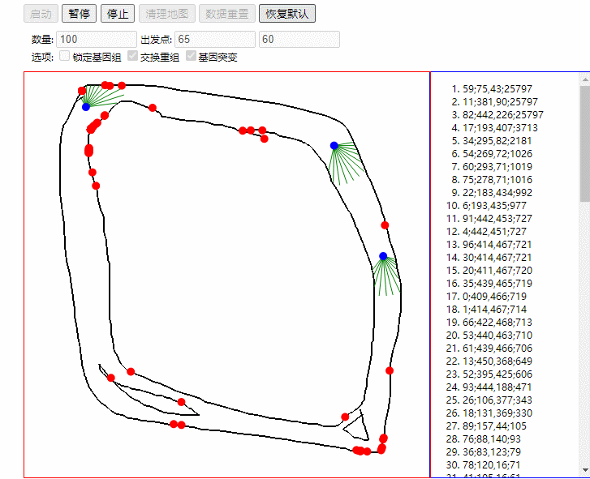

# 汤姆车
[English](README_EN.md)\

这是一个演示训练汤姆开车的算法，该训练算法使用了遗传算法和神经网络算法。

## 网页示例
网页示例：example/index.html 
在线体验: https://zmdo.cn/tomcar/

你可以自己绘制地图或者使用默认的地图。如果想要改变汤姆车数量和初始位置，那么需要重新加载所有汤姆车数据。而如果只是进行停止/启动以及重新绘制地图的数据，那么将会直接使用当前的汤姆车数据。

如果想测试当前汤姆车训练的成熟度，可以先清理地图并绘制新的地图，在使用 锁定基因组 的选项后进行启动即可。

## 项目结构

- doc : 项目文档及图片
- example : 项目打包后的案例
- src : 项目源码
  - core : 核心组件与接口定义
  - ga : 基因算法（Genetic Algorithm）接口定义
  - graphics : 图像绘制接口定义
  - physics : 物理接口定义
  - tom : 实际的接口实现
- tool : 项目工具

## 项目工具使用

1. 首先使用纯红色(#FF0000)的画笔在白色背景绘制地图，并将其命名为 map.png
2. 将 map.png 放置在 tool 目录下，运行 mapmaker.py
3. 将运行结果赋值给 [example/js/map.js](example/js/map.js) 的 `DEFAULT_MAP`
