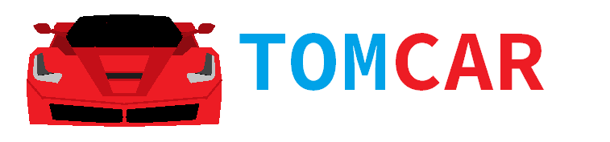
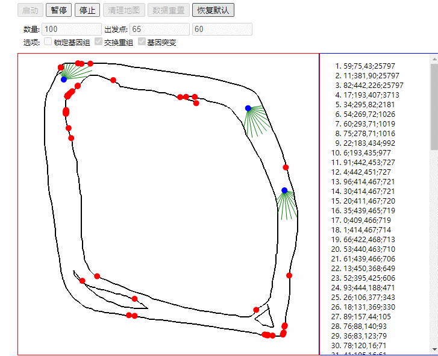

# Tomcar
[简体中文](README.md)\

This is an algorithm that demonstrates training Tom to drive using a genetic algorithm and a neural network algorithm.

## Web example
web example : example/index.html
experience online : https://zmdo.cn/tomcar/

You can draw your own map or use the default one. If you want to change the number and initial position of Tom cars, you need to reload all Tom cars data. And if it is just stop/start and redraw the map data, then the current Tom car data will be used directly.

If you want to test the maturity of the current Tom car training, you can first clean up the map and draw a new map, and start it after using the option to lock the gene.

## Project structure

- doc : Project documents and images
- example : The case after the project is packaged
- src : Project source
    - core : core components and interfaces
    - ga : Genetic Algorithm interfaces
    - graphics : Image drawing interfaces
    - physics : Physics interfaces 
    - tom : Actual interface implementation
- tool : Project tool

## How to use the project tool

1. First use a pure red (#FF0000) brush to draw a map on a white background, and name it map.png
2. Place map.png in the tool directory and run mapmaker.py
3. Assign the running result to `DEFAULT_MAP` of [example/js/map.js](example/js/map.js)